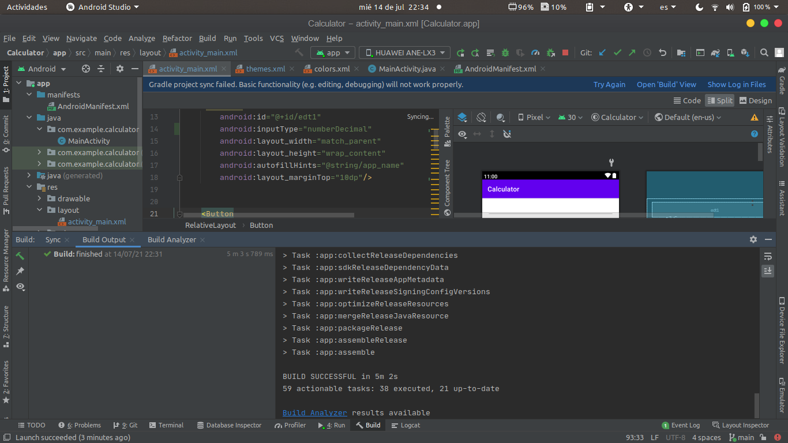
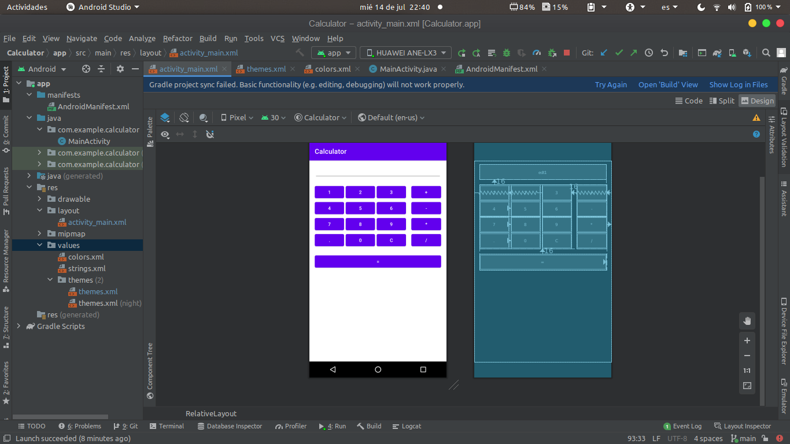
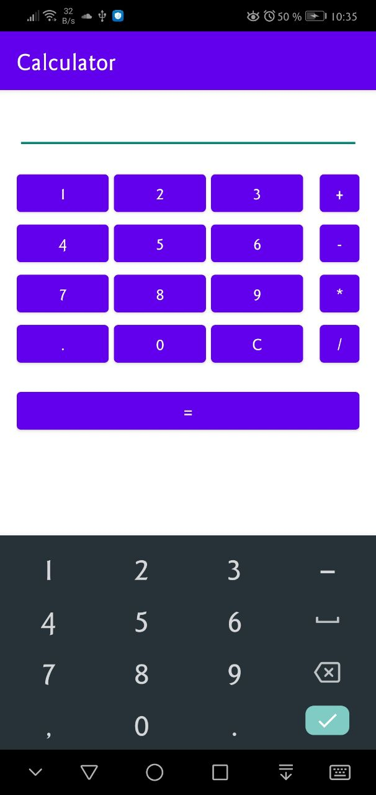
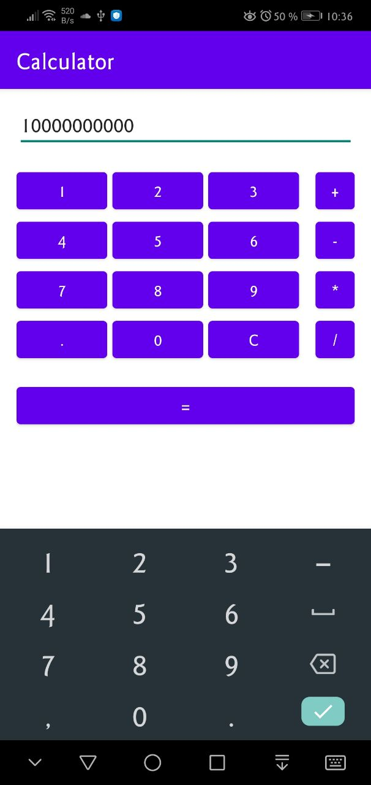
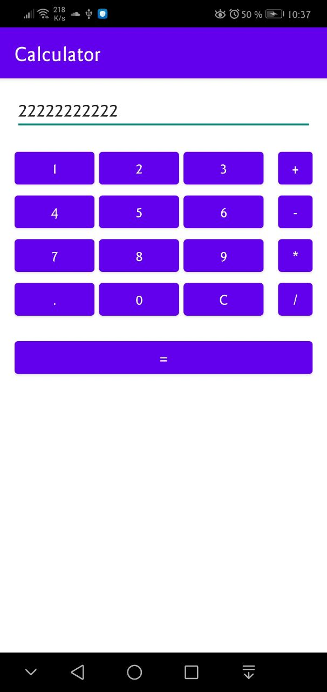

# Práctica 6: Proyecto Android e Interfaz Gráfica

**Objetivo:** Entender conceptos relacionados a la implementación de aplicaciones con interfaz gráfica en Android y Java.

## Evidencias de la Práctica

1. __Build successful__
   

2. __Activity Design__
   

3. __Application debugging on mobile device__
   

4. __Mobile numeric keyboard__
    

5. __Use of application buttons__

    
